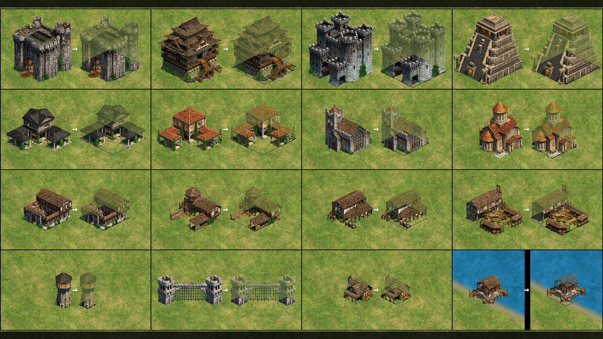

# AoE2 DE Transparent Buildings

A mod for Age of Empires II: Definitive Edition that makes buildings semi-transparent, letting you see units and terrain behind them.

The upper portion of each building sprite gets checkerboard dithering applied directly to the SLD graphics files, using DXT1's built-in transparency mode. The foundation/base of each building stays fully opaque, and a team-colored outline marks the building footprint on the ground.



**Note:** Largely vibe-coded.

## Download

Subscribe to the pre-built mod on the [AoE2 DE mod hub](https://www.ageofempires.com/mods/details/469773/) or search "Transparent Buildings" in the in-game mod browser.

**Without outline:**
- [Transparent Buildings](https://www.ageofempires.com/mods/details/469704/)
- [Transparent Buildings (UHD - Part 1)](https://www.ageofempires.com/mods/details/469706/)
- [Transparent Buildings (UHD - Part 2)](https://www.ageofempires.com/mods/details/469707/)

**With foundation outline:**
- [Transparent Buildings with Outline](https://www.ageofempires.com/mods/details/469773/)
- [Transparent Buildings with Outline (UHD - Part 1)](https://www.ageofempires.com/mods/details/469774/)
- [Transparent Buildings with Outline (UHD - Part 2)](https://www.ageofempires.com/mods/details/469775/)

UHD versions are split into two parts due to the 1 GB upload size limit. After subscribing, enable the mod in the in-game mod manager and restart the game.

## How it works

The mod operates on AoE2 DE's SLD sprite files (a GPU-compressed texture format using DXT1/BC4 blocks). For each building:

1. **Parses the SLD file** into frames and layers (main graphic, shadow, damage mask, player color)
2. **Computes an isometric diamond** matching the building's tile footprint to determine where the foundation is
3. **Applies checkerboard dithering** to all pixels above the foundation line by setting DXT1 block indices to transparent (index 3 in transparent mode where `color0 <= color1`)
4. **Draws a team-color outline** around the foundation diamond using the player color (BC4) layer
5. **Writes the modified SLD** back out, preserving all other data byte-identically

All processing happens at the compressed block level — no full decode/re-encode of textures, so quality loss is minimal and processing is fast (~0.3s per file).

**Zero performance impact** — this is not real-time transparency. The mod produces pre-baked sprite files with checkerboard dithering, so the game renders them at the same speed as normal buildings. As a bonus, the dithered pixels create tiny click-through holes, making it easier to select units or buildings behind other buildings.

## Features

- Checkerboard dithering on building upper portions
- Isometric foundation diamond with team-colored outline
- Edge protection to keep building silhouette edges opaque
- Optional gradient transition zone near the foundation line
- Per-building footprint sizes (1x1 outposts through 5x5 wonders, plus asymmetric gates)
- Multiprocessing batch mode for processing all ~1775 building files
- Round-trip verified SLD parser/writer (byte-identical output on unmodified files)

## Getting started

Requires [uv](https://docs.astral.sh/uv/) and Python 3.13+.

```bash
uv sync
```

The tool auto-detects your AoE2 DE Steam install and mod directories. If auto-detection fails (non-standard install location), set these environment variables:

```bash
set AOE2_GRAPHICS_DIR=D:\SteamLibrary\steamapps\common\AoE2DE\resources\_common\drs\graphics
set AOE2_MOD_DIR=C:\Users\YourName\Games\Age of Empires 2 DE\<steam_id>\mods\local\TransparentBuildings
```

## Usage

Build the mod (processes all buildings):

```bash
uv run build-mod
```

Process a single file:

```bash
uv run build-mod --file b_west_castle_age4_x1.sld
```

### Options

| Flag | Description | Default |
|------|-------------|---------|
| `--file FILE` | Process a specific SLD file | all buildings |
| `--workers N` | Number of parallel workers | CPU count |
| `--outline-value N` | Foundation outline brightness (0-255) | 200 |
| `--outline-thickness N` | Outline band height in pixels | 4 |
| `--no-outline` | Disable foundation outline | off |
| `--exclude [TYPE ...]` | Building types to exclude (e.g. `mill monastery`) | `mill` |
| `--edge-inset N` | Pixels from building edge to keep opaque (auto-scaled 2x for UHD) | 3 |
| `--gradient-height N` | Transition zone height above foundation | 0 |
| `--tile-height N` | Override tile half-height in pixels | 24 (x1) / 48 (x2) |
| `--output-dir DIR` | Override output directory | AoE2 local mods folder |
| `--dry-run` | Parse only, don't write files | off |

### Testing in-game

The build outputs files to your local mods folder. To test changes:

1. Open AoE2 DE and go to the mod manager
2. If you have the published "Transparent Buildings" mod installed, **disable it** — local and subscribed mods with overlapping files will conflict
3. Enable the **local** "Transparent Buildings" mod
4. **Restart the game** — AoE2 only loads mod assets on startup, so you need a full restart after every rebuild to see changes

Unlike the mod hub versions (which are split into multiple parts due to a 1 GB upload limit), the locally built mod contains everything in a single mod — no need to manage separate x1 (standard graphics) and x2 (UHD graphics) packages.

### Debug tools

Inspect an SLD file's structure:

```bash
uv run inspect-sld b_west_castle_age4_x1.sld
```

Visualize a building's sprite shape and foundation diamond:

```bash
uv run analyze-shape b_west_castle_age4_x1.sld
```

Verify tile footprint calculations:

```bash
uv run check-tiles
```

Round-trip test (requires game files):

```bash
uv run test-roundtrip
```

### Running tests

```bash
uv run pytest
```

The test suite runs without game files — it uses synthetic SLD data.

## Known limitations

- **Elevation still hides holes** — hilly terrain can obscure gaps between buildings even with transparency. You'll still need to right-click patrol or check pathing on hills.
- **Can't be toggled in-game** — AoE2 modding only supports texture replacement, not interactive features. The transparency is always on.
- **Mills are excluded by default** because their windmill animation causes glitchy dithering artifacts. Override with `--exclude` to change which buildings are skipped.

## Project structure

| File | Description |
|------|-------------|
| `build_mod.py` | Main mod builder: dithering, outlines, batch processing |
| `sld.py` | SLD file format parser and writer |
| `dxt.py` | DXT1/BC4 block codec with fast transparency injection |
| `paths.py` | Auto-detection of AoE2 DE install and mod directories |
| `tests/` | Unit tests (run with `uv run pytest`) |
| `tools/inspect_sld.py` | Debug tool: dump SLD file structure |
| `tools/analyze_shape.py` | Debug tool: visualize building sprite shapes |
| `tools/check_tiles.py` | Debug tool: verify tile footprint calculations |
| `tools/test_roundtrip.py` | Round-trip test to verify SLD parser/writer correctness |

## SLD format notes

The SLD format (since AoE2 DE update 66692) stores GPU-compressed sprites:

- **File header**: 16 bytes — magic `SLDX`, version, frame count
- **Layers**: main graphic (DXT1), shadow (BC4), damage mask (DXT1), player color (BC4), plus an unknown/outline layer
- **Block commands**: skip/draw run-length encoding for sparse 4x4 block grids
- **Bit layout**: layer presence bits are 0-4 (not 7-3 as the openage spec's bit numbering suggests)

Reference: [openage SLD spec](https://github.com/SFTtech/openage/blob/master/doc/media/sld-files.md)

## Installation

After processing, the mod files are placed in your AoE2 DE local mods folder:

```
%USERPROFILE%\Games\Age of Empires 2 DE\<steam_id>\mods\local\TransparentBuildings\
```

Enable "Transparent Buildings" in the in-game mod manager.